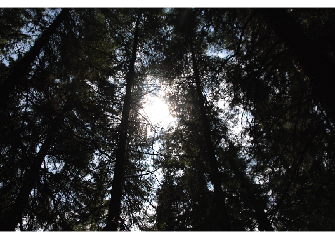

# LAI package for R

This package calculates leaf area index (LAI) from digital images.

The LAI value is computed from the gap fraction of a binarized vegetation image classified with the histogram-based unimdal threshold method.

## To install : 

```r
library(devtools)
devtools::install_github("cmartin/LAI")
```


## To try the code with one of the example images : 

```r
library(raster)

test_image <-  system.file("extdata", "IMG_7595.JPG", package = "LAI")

# See the image
plotRGB(
  brick(test_image),
  asp = 1
)
```

 

```r
# Calculate LAI
LAI_from_gf_at_57(test_image)
```

```
[1] 2.45923
```

## Problems : 
Please report any bugs to the [GitHub issue tracker](https://github.com/cmartin/LAI/issues) and write any questions to <charles.martin1@uqtr.ca>

## Citation
If this code is useful to you, please cite as : 

```
Charles A. Martin (2015). LAI: Calculate indirect Leaf Area Index (LAI) from images. R package version 0.0.0.9004. https://github.com/cmartin/LAI
```
